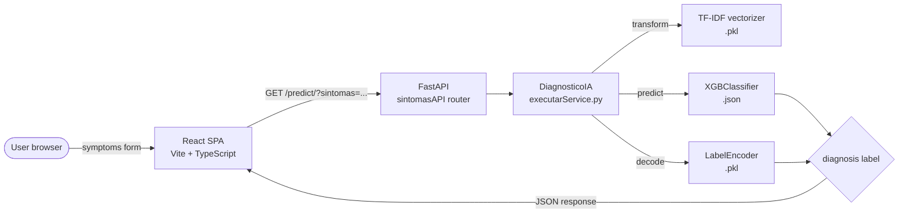

HealthIA is a two-tier web application: a React single-page application that collects symptoms from the user, and a FastAPI backend that runs an XGBoost classifier to predict the most likely medical condition.

## System components

<Columns cols={2}>
  <Card title="React SPA" icon="browser">
    Vite + TypeScript frontend served on `localhost:5173` in development. Collects 2–8 symptoms, calls the REST API, and renders the predicted diagnosis.
  </Card>
  <Card title="FastAPI backend" icon="server">
    Python API served on `localhost:8000`. Handles CORS, validates requests, and delegates inference to the ML service layer.
  </Card>
  <Card title="ML services" icon="cpu">
    A set of Python modules responsible for TF-IDF vectorization, XGBoost training, artifact persistence, and live inference.
  </Card>
  <Card title="Model artifacts" icon="database">
    Three files saved to `HEALTHIA/model/`: the trained XGBoost model (JSON), the fitted TF-IDF vectorizer (pickle), and the label encoder (pickle).
  </Card>
</Columns>

## Data flow — single prediction request

<Steps>
  <Step title="User enters symptoms">
    The user selects between 2 and 8 symptoms in `SymptomInput.tsx`. The component enforces `MIN_SYMPTOMS = 2` and `MAX_SYMPTOMS = 8` before enabling submission.
  </Step>
  <Step title="Frontend sends HTTP request">
    `services/api.ts` calls `GET /predict/?sintomas=<comma-separated-list>` against `VITE_API_BASE_URL` (defaults to `http://127.0.0.1:8000`).
  </Step>
  <Step title="FastAPI routes the request">
    The `sintomasAPI` router receives the query parameter and passes the symptom list to the `DiagnosticoIA` inference class.
  </Step>
  <Step title="Inference pipeline runs">
    `DiagnosticoIA.predict_simples()` joins the symptom list into a string, transforms it with the pre-fitted TF-IDF vectorizer, and calls `XGBClassifier.predict()`.
  </Step>
  <Step title="Label is decoded and returned">
    The integer class index is decoded with the fitted `LabelEncoder` to recover the human-readable condition name. The API returns `{ sintomas, diagnostico_previsto }`.
  </Step>
  <Step title="Frontend renders the result">
    `PredictionResult.tsx` displays the diagnosis, the symptom list, and a timestamp. The result is also appended to the diagnosis history managed by `useDiagnosisHistory`.
  </Step>
</Steps>

## Architecture diagram



## Deployment considerations

### CORS configuration

The backend resolves allowed origins from three sources, evaluated in order:

| Source | Description |
| --- | --- |
| Hardcoded defaults | `http://127.0.0.1:5173` and `http://localhost:5173` for local development. |
| `FRONTEND_URLS` env var | Comma-separated list of additional origins appended to the allow-list. |
| `FRONTEND_URL` env var | Single additional origin (legacy convenience variable). |

A regex rule `^https://.*\.up\.railway\.app$` is also applied so that any Railway.app subdomain is automatically accepted without listing it explicitly.

To allow every origin during development or testing, set:

```bash
ALLOW_ALL_ORIGINS=true
```

<Warning>
Setting `ALLOW_ALL_ORIGINS=true` disables all origin checks. Do not use this in production.
</Warning>

### Local development ports

| Service | Default address |
| --- | --- |
| FastAPI backend | `http://127.0.0.1:8000` |
| Vite dev server | `http://localhost:5173` |

The frontend reads the backend address from the `VITE_API_BASE_URL` environment variable at build time. Override it in a `.env` file or your CI environment to point at a remote backend.

```bash
# .env
VITE_API_BASE_URL=https://healthia-api.up.railway.app
```
